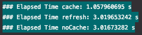

# Ehcache 를 구성해보자!

## 환경

- springboot 2.5.0
- net.sf.ehcache 2.10.9.2
- H2, JPA

--- 

## 프로젝트 설명

- H2 기반 member entity 생성
- service layer 에 ehcache 설정

## 테스트

> - 조회를 위한 Member 초기값 세팅
> - 각 3번 호출 테스트
> - JPA 1차 캐시 초기화를 위해 각 호출 간 em.clear()

- cache - 최초 호출 1초 이후 캐싱
- noCache - 모든 호출 1초
- refresh 후 cache - 모든 호출 1초

---

## CacheManager

캐시 인스턴스에 접근하기 위한 인터페이스

- Generic
- JCache (JSR-107) (EhCache 3, Hazelcast, Infinispan, and others)
- EhCache 2.x
- Hazelcast
- Infinispan
- Couchbase
- Redis
- Caffeine
- Simple

## ehcache 속성

| property                        | description                                                                    | default | required |
| ------------------------------- | ------------------------------------------------------------------------------ | ------- | -------- |
| maxEntriesLocalHeap             | heap 캐시 메모리 pool size 설정. GC 대상이 됨.                                 |         |          |
| maxMemoryOffHeap                | 캐시 메모리 pool size 설정.   ehcache 가 관리하며 GC 대상에서 제외.         |         |          |
| maxEntriesLocalDisk             | disk pool size 설정                                                            |         |          |
| eternal                         | true 일 경우   timeout 관련 설정이 무시. element 가 캐시에서 삭제되지 않음. | false   | true     |
| timeToldleSeconds               | 사용되지 않는 element 가 존재하는 최대 시간.   0 이면 만료 되지 않는다.     | 0       | false    |
| timeToLiveSeconds               | element 가 존재하는 최대 시간.   0 이면 만료 되지 않는다.                   | 0       | false    |
| diskPersistent                  | VM 이 재 가동시 디스크 저장소에 캐싱된 객체를 가져올지 여부                    | false   | false    |
| diskExpiryThreadIntervalSeconds | disk expiry 쓰레드 수행 간격                                                   | 120     | false    |
| memoryStoreEvictionPolicy       | 객체의 개수가 maxElementsInMemory 에 도달시 제거 정책.   LRU, FIFO, LFU     | LRU     | false    |

## @Cacheable

| property             | description                                                                                                           | default |
| -------------------- | --------------------------------------------------------------------------------------------------------------------- | ------- |
| value   cacheName | ehcache.xml 또는 ehcach config 에 구성된 cache name.                                                                  | {}      |
| key                  | cacheName 이 동일할시 구분 값 (상수 권장)                                                                             | ""      |
| cacheManager         | 사용 할 CacheManager 지정                                                                                             | ""      |
| condition            | 캐싱 적용 조건   ex) @Cacheable(key = "testKey", condition="#caching")   public Object getSome(boolean caching) | ""      |
| unless               | 캐싱 미적용 조건                                                                                                      | ""      |
| sync                 | 동기화 여부                                                                                                           | false   |

## @CacheEvict

| property             | description                                                                                                           | default |
| -------------------- | --------------------------------------------------------------------------------------------------------------------- | ------- |
| value   cacheName | ehcache.xml 또는 ehcach config 에 구성된 cache name.                                                                  | {}      |
| key                  | cacheName 이 동일할시 구분 값 (상수 권장)                                                                             | ""      |
| cacheManager         | 사용 할 CacheManager 지정                                                                                             | ""      |
| condition            | 캐싱 적용 조건   ex) @Cacheable(key = "testKey", condition="#caching")   public Object getSome(boolean caching) | ""      |
| allEntries           | 선언된 메서드로 캐싱된 캐시 리소스 삭제                                                                               | false   |
| beforeInvocation     | true - 메서드 수행 이전 캐시 리소스 삭제    false - 메서드 수행 후 캐시 리소스 삭제                                | false   |
