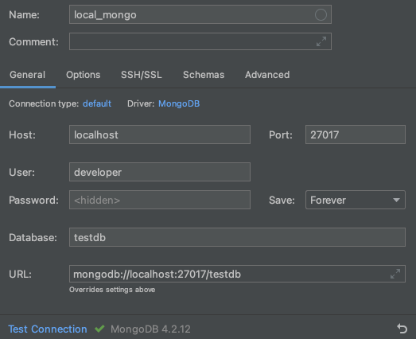
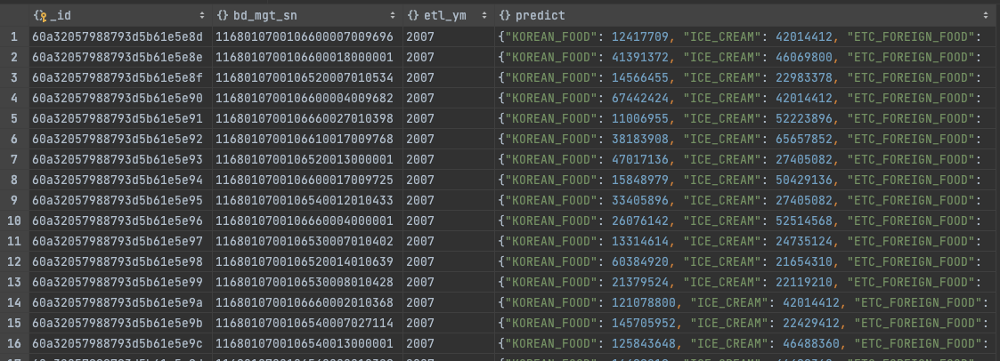
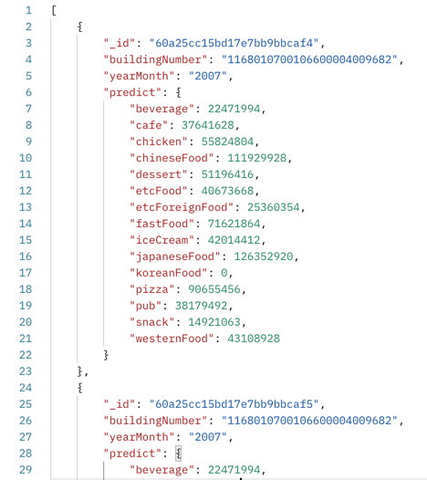

# mongoDB 를 구성해보자!

## 환경

- docker (local)
- mongoDB 4.2.12
- springboot 2.4.5

---

### 1. docker 를 이용한 mongoDB 설치 & 기동

> pull image

```shell
☁  mongodb [develop] ⚡  docker pull mongo:4.2.12
4.2.12: Pulling from library/mongo
Status: Downloaded newer image for mongo:4.2.12

☁  mongodb [develop] ⚡  docker images
REPOSITORY                  TAG       IMAGE ID       CREATED         SIZE
mongo                       4.2.12    0a3da748da38   2 months ago    388MB
```

> run with docker-compose.yml

```shell
☁  mongodb [develop] ⚡  docker-compose up -d
Creating network "mongodb_default" with the default driver
Creating local_mongo ... done
☁  mongodb [develop] ⚡  docker ps
CONTAINER ID   IMAGE          COMMAND                  CREATED         STATUS         PORTS                               NAMES
19a9fa13ce5a   mongo:4.2.12   "docker-entrypoint.s…"   7 seconds ago   Up 6 seconds   0.0.0.0:27017->27017/tcp            local_mongo
```

> install mongodb-database-tools

```shell
☁  mongodb [develop] ⚡  brew install mongodb-database-tools
==> Installing mongodb-database-tools from mongodb/brew
==> Downloading https://fastdl.mongodb.org/tools/db/mongodb-database-tools-macos-x86_64-100.3.1.zip
Already downloaded: /Users/choibyunghyeon/Library/Caches/Homebrew/downloads/6cc17321e1e8cd71c9a41b1aa722eba5ca0a9e759234e25b71eb9c8ff71e0033--mongodb-database-tools-macos-x86_64-100.3.1.zip
🍺  /usr/local/Cellar/mongodb-database-tools/100.3.1: 13 files, 150.9MB, built in 5 seconds
```

### 2. mongoDB 접속

> add new database `testdb`, add newUser `developer`

```shell
☁  mongodb [develop] ⚡  docker exec -it local_mongo bash
root@19a9fa13ce5a:/# mongo -u root -p root --authenticationDatabase "admin"
MongoDB shell version v4.2.12
> use testdb
switched to db testdb
# add newUser `developer`
> db.createUser({ user: "developer", pwd: "1234", roles: ["dbAdmin", "readWrite"] })
Successfully added user: { "user" : "developer", "roles" : [ "dbAdmin", "readWrite" ] }
> db.auth("developer","1234");
1
# database 추가를 위해 document 추가
> db.book.insert({"name": "MongoDB Tutorial", "author": "velopert"});
WriteResult({ "nInserted" : 1 })
>
```

> datagrip 으로 접속



### 3. 대용량건 import (1회 최대 10만건)

```shell
☁  mongodb [develop] ⚡  mongoimport --username root --password root --uri="mongodb://localhost:27017/testdb" --authenticationDatabase admin --collection=market_analysis --file=/Users/choibyunghyeon/Downloads/sample.json
2021-05-17T21:08:33.740+0900	connected to: mongodb://localhost:27017/testdb
2021-05-17T21:08:36.768+0900	50000 document(s) imported successfully. 0 document(s) failed to import.
```

```shell
db.market_analysis.find()
```



### 4. 데이터 불러오기

`데이터 불러오기` 커밋 확인


